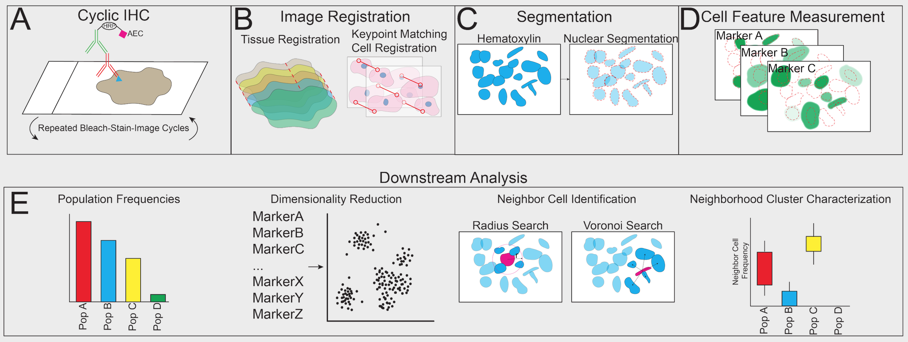

# CASSATT - Cyclic Analysis of Single-Cell Subsets and Tissue Territories

This repository contains the Python implementation of CASSATT, a workflow designed to streamline cyclic immunohistochemistry data analysis. This is described in the following paper: 

PAPER LINK.

## Overview

Cyclic immunohistochemistry utilizes sequential rounds of colorimetric immunostaining and imaging to quantitatively map cells of interest. This technique can be used to uncover spatial relationships between different cellular subpopulations found within a given tissue specimen. CASSATT automates immunohistochemistry data analysis by 1) achieving tissue-level and cell-level registration across imaging rounds and 2) providing modular options for downstream neighborhood analysis. The following figure provides a graphical summary of the pipeline.

    

## Repository Structure (TODO)

## Installation & Usage (TODO)
