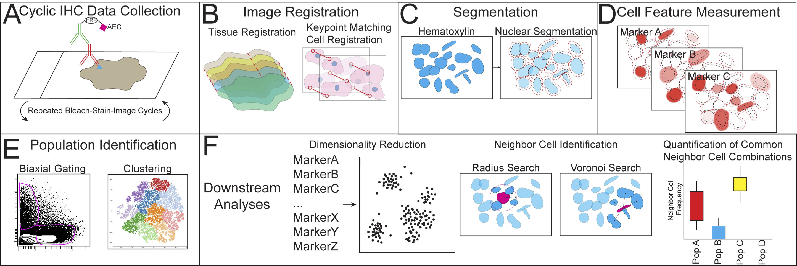

# CASSATT - Cyclic Analysis of Single-Cell Subsets and Tissue Territories

This repository contains the Python implementation of CASSATT, a workflow designed to streamline cyclic immunohistochemistry data analysis. This is described in the following paper: 

[Alignment, Segmentation and Neighborhood Analysis in Cyclic Immunohistochemistry Data Using CASSATT](https://www.biorxiv.org/content/10.1101/2022.08.29.504975v1)

## Overview

Cyclic immunohistochemistry utilizes sequential rounds of colorimetric immunostaining and imaging to quantitatively map cells of interest. This technique can be used to uncover spatial relationships between different cellular subpopulations found within a given tissue specimen. CASSATT automates immunohistochemistry data analysis by 1) achieving tissue-level and cell-level registration across imaging rounds and 2) providing modular options for downstream neighborhood analysis. The following figure provides a graphical summary of the pipeline.



## Demo Dataset

A sample dataset is provided under the `sample` folder. Here, you'll find 1) a collection of marker-specific images obtained from a test specimen, 2) gated immune populations (required as input for `demo_neighborhood.ipynb`), and 3) the stardist model used for single-cell segmentation. 

To demo CASSATT, download both notebooks under the `notebooks` folder. `demo_dataset.ipynb` registers and tiles tissue specimens to generate single-cell readout measurements. `demo_neighborhood.ipynb` analyzes the previously generated single-cell expression data, including detection of cell subsets and calculation of log odds ratios of interactions between gated populations. To run the workflow, simply change the variables `output_dir` and `raw_img_dir` in both notebooks and `stardist_dir` in `demo_dataset.ipynb`. Other hyperparameters are also exposed to better tune the workflow to your own needs, including the ability to run multiple slides in parallel and see step-by-step outputs.

## Expected Output

The high-level output directory structure after running both notebooks on the sample dataset is as follows:

```
output_folder
├── BaseAligned
├── BaseImages
├── CroppedStacks
├── Labels
├── Neighborhood
    ├── Gated_Input
    ├── Gated_Perslide
    ├── LogOdds
        └── Interactions
            ├── Slide
            └── Tile
    ├── Neighbor_CSVs
    ├── Neighborhood_Plots
        ├── Per_Cluster
        └── Per_Slide
    ├── Neighborhood_Umap_CSVs
    └── Voronoi_N16-244-2A_r0_c1.pdf
├── Plots
├── Registered
    ├── N16-244-2A_PD-1_r0_c0.tiff
    ├── N16-244-2A_PD-1_r0_c1.tiff
    ├── N16-244-2A_PD-1_r1_c0.tiff
    └── N16-244-2A_PD-1_r1_c1.tiff
├── StitchedSlides
├── Tiled
    ├── Aligned_0_Base_N16-244-2A_PD-1
    ├── Aligned_1_Base_N16-244-2A_PD-L1
    ├── Aligned_2_Base_N16-244-2A_CD68
    ├── Aligned_3_Base_N16-244-2A_CD3
    ├── Aligned_4_Base_N16-244-2A_FoxP3
    ├── Aligned_5_Base_N16-244-2A_Iba-1
    ├── Aligned_6_Base_N16-244-2A_CD8
    └── Aligned_7_Base_N16-244-2A_CD4
├── df_all.csv
└── N16-244-2A_export.csv
```
Please refer to the paper for a detailed description of the individual output files.

## Installation & Usage (In-Progress)

Currently, the code is being refactored to be installable via pip. More details will follow as to how to properly install the package. Stay tuned!
